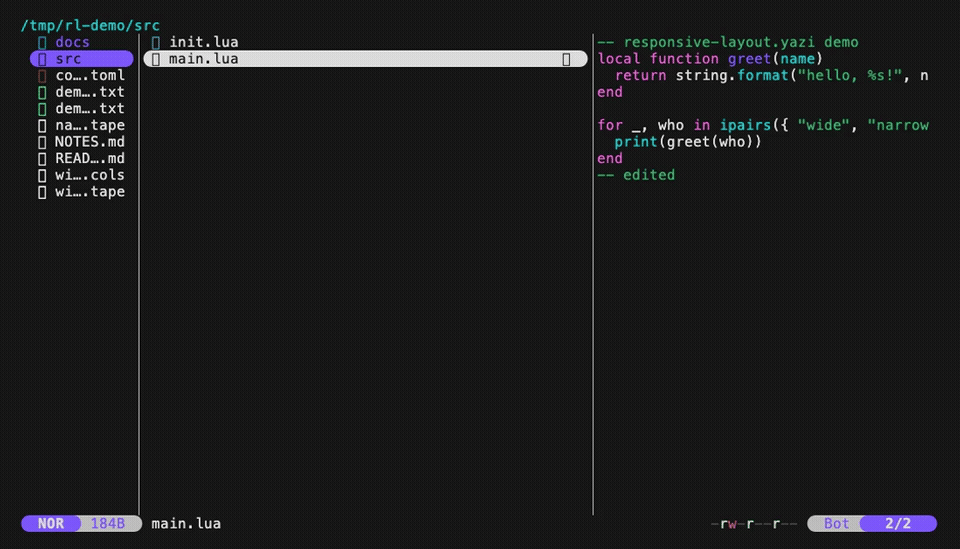

# 🪟 responsive-layout.yazi

> Your file manager, but it actually fits your terminal.

A tiny [Yazi](https://github.com/sxyazi/yazi) plugin that makes the manager layout **responsive to terminal width** — the full three-pane spread when you have room, and a clean **vertically-stacked** view when you don't. No more three cramped columns fighting over 40 characters.

<p align="center">
  <a href="https://github.com/leduckhc/responsive-layout.yazi/stargazers"></a>
  
  
  
</p>

<p align="center">
  
  <br>
  <em>Same files, same content — three panes when there's room (105 cols), stacked vertically when there isn't (55 cols).</em>
</p>

---

## ✨ Why?

Yazi's default layout is three panes side-by-side: **parent │ current │ preview**. That's beautiful on a wide monitor — and miserable in a split pane, an SSH popup, or a phone-sized terminal, where each column gets a dozen characters and every filename is `reallylo…`.

This plugin fixes that automatically. Resize your terminal and the layout **flips live**:

```
        WIDE  (≥ wide_min cols)                 NARROW  (< wide_min cols)
 ┌────────┬───────────┬────────────┐          ┌────────────────────────┐
 │ parent │  current  │  preview   │          │        current         │
 │        │           │            │          │                        │
 │  src/  │  main.lua │  -- code   │          │  main.lua              │
 │  docs/ │  init.lua │  -- here   │          │  init.lua              │
 │        │           │            │          ├────────────────────────┤ ← divider
 │        │           │            │          │        preview         │
 │        │           │            │          │  -- code preview here  │
 └────────┴───────────┴────────────┘          └────────────────────────┘
```

No keybinding to remember, no mode to toggle. It just adapts.

## 🚀 Features

- 📐 **Width-aware** — switches layout on every resize, instantly.
- 🧱 **Vertical stacking** — current on top, preview on the bottom, so both stay readable when narrow.
- ➖ **Clean divider** — a configurable horizontal rule between the stacked panes (and no leftover vertical rail).
- 🎛️ **Configurable** — one threshold, one split ratio, one divider glyph.
- 🤝 **Plays nice** — reads Yazi's runtime ratio, so [`toggle-pane.yazi`](https://github.com/yazi-rs/plugins/tree/main/toggle-pane.yazi) (hide/maximize panes) keeps working in wide mode.
- 🪶 **Featherweight** — ~100 lines of Lua, no dependencies.

## 📦 Installation

```sh
ya pkg add leduckhc/responsive-layout
```

<details>
<summary>Or install manually</summary>

Copy `main.lua` to `~/.config/yazi/plugins/responsive-layout.yazi/main.lua`.
</details>

## ⚙️ Setup

Add to your `~/.config/yazi/init.lua`:

```lua
require("responsive-layout"):setup {
	wide_min = 90,  -- ≥ this width (cols) → 3 panes; below → vertical stack
	split    = 0.5, -- fraction of height given to the top (current) pane when stacked
	divider  = "─", -- glyph used for the horizontal divider in stacked mode
}
```

All options are optional — omit any and the defaults above kick in. That's it. Start Yazi and resize away.

### Options

| Option     | Type     | Default | Description                                                          |
| ---------- | -------- | ------- | -------------------------------------------------------------------- |
| `wide_min` | `number` | `90`    | Terminal width (columns) at/above which all three panes show.        |
| `split`    | `number` | `0.5`   | Height fraction for the top (current) pane in stacked mode (`0`–`1`). |
| `divider`  | `string` | `"─"`   | Glyph repeated to draw the divider between the stacked panes.        |

> **Tip:** Prefer a bigger file list than preview when stacked? Try `split = 0.6`.
> Want a heavier divider? `divider = "═"`. Want an invisible one? `divider = " "`.

## 🤝 Compatibility & Notes

- **`toggle-pane.yazi`** — fully compatible. In wide mode the plugin honors `rt.mgr.ratio`, so hiding/maximizing panes still works.
- **`full-border.yazi`** and other UI plugins that override the `Tab` component **can conflict** — whichever `setup()` runs **last** wins. Order your `require(...):setup{}` calls intentionally.
- Requires **Yazi ≥ 26.1.22** (uses the modern `ui`/`rt`/`th` component API).

## 🧠 How it works

Yazi builds its whole UI from overridable Lua components. This plugin overrides two methods on the `Tab` component:

- **`Tab:layout()`** — picks the pane rectangles based on `self._area.w`. Wide → a horizontal `ui.Layout` split honoring the runtime ratio. Narrow → three manually-computed rects (a zero-width parent, a top `current`, and a bottom `preview`) plus a one-row divider rect.
- **`Tab:build()`** — assembles the child components. In stacked mode it swaps the vertical `Rails` for a small horizontal-divider component.

Yazi re-runs this on every resize, which is why the switch feels instant.

## 🙌 Credits

Born from a late-night "why are there three panes in my 40-column terminal" moment. Built on the shoulders of the excellent Yazi component system and inspired by the official `toggle-pane`, `full-border`, and `no-status` recipes.

## 📄 License

[MIT](LICENSE) © leduckhc
